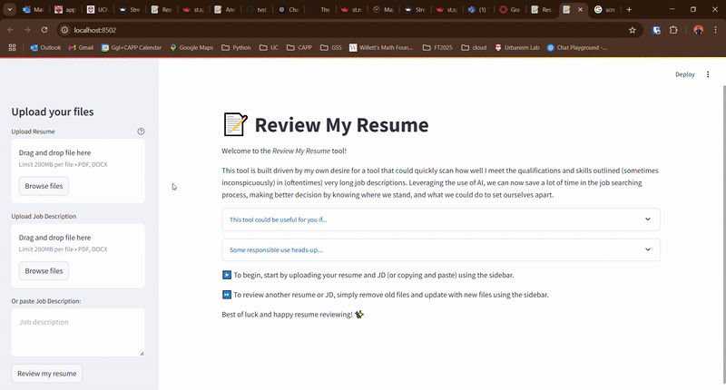
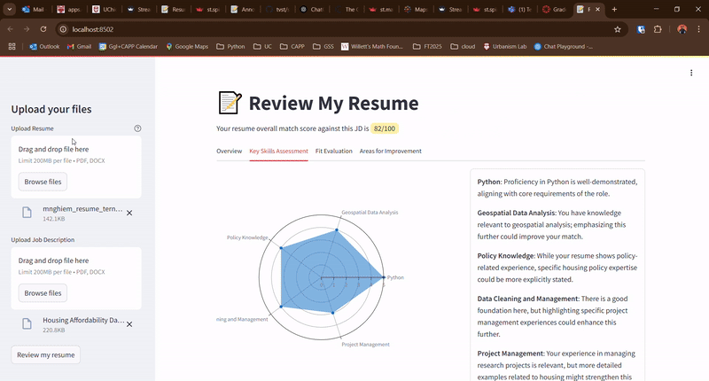

# Project Review My Resume
**How well does my resume match with this job description?**

MPCS 57200 Generative AI Capstone Project - Minh Nghiem

## Project Description
This tool is built driven by my own desire for a tool that could quickly scan how well I meet the qualifications and skills outlined (sometimes inconspicuously) in (oftentimes) very long job descriptions. Leveraging the use of AI, we can now save a lot of time in the job searching process and make better decisions by knowing where we stand, and what we could do to set ourselves apart.

## Final work Preview

## How to use the tool

I have uploaded to the repo a brief project presentation with the motivations and usage demo. The video can be accessed at `./demo/presentation.mp4`

## How to host this app on your local machine

Tool directory structure:
- `./demo` contains demo of interface and app usage
- `./prompts` contains script(s) to feed into generative AI models for prompting
- `./sample_data` contains testing data for development and testing to limit the number of API requests
- `./utils.py` contains utility functions to be used in the main application
- `./app.py` contains main application code to display and run the app on streamlit

Hosting this app on your machine:
1. Add an `.env` file containing your OpenAI API key to the root directory. The formatting is as follows: `OPENAI_API_KEY="paste-your-api-key-here"`.
2. Run `uv sync` in the terminal to install all necessary packages.
3. From the root directory, run `streamlit run app.py` to interact with the app in your own browser.

## Afterword
The future development of the app includes experimenting with different generative AIs (Claude, DeepSeek, etc..) to evaluate performance in terms of speed, quality, and consistency. Currently, OpenAI yields decent quality results with wait-time averaging at 10 seconds for a fairly long pair of resume/JD. Consistency is within boundaries of 10-20 points in match score.